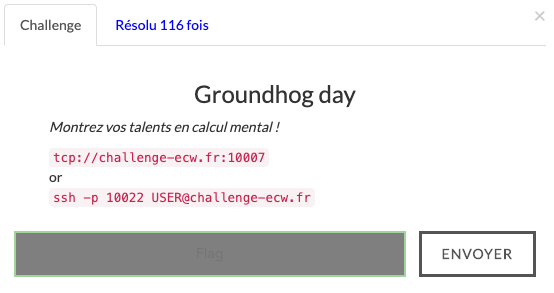

+++
title = 'Groundhog Day'
date = 2020-11-03
draft = false
categories = ['ctf']
tags = ['ecw','misc']
+++

# Challenge description

This challenge was part of the European Cyber Week Qualification.

The goal of this challenge was to find the transcription of a text. To find the transcription, for each step, we can sent two entries and see the result of the output. Once these two tests done we received a sentence and we need to transcript it in letters.
This challenge was cool and funny this is the reason of this WU.

# Solve

After some manual tests the only one option was to script the solution. Indeed, after some manual tests , I see that there will be lots of test just for the first step
